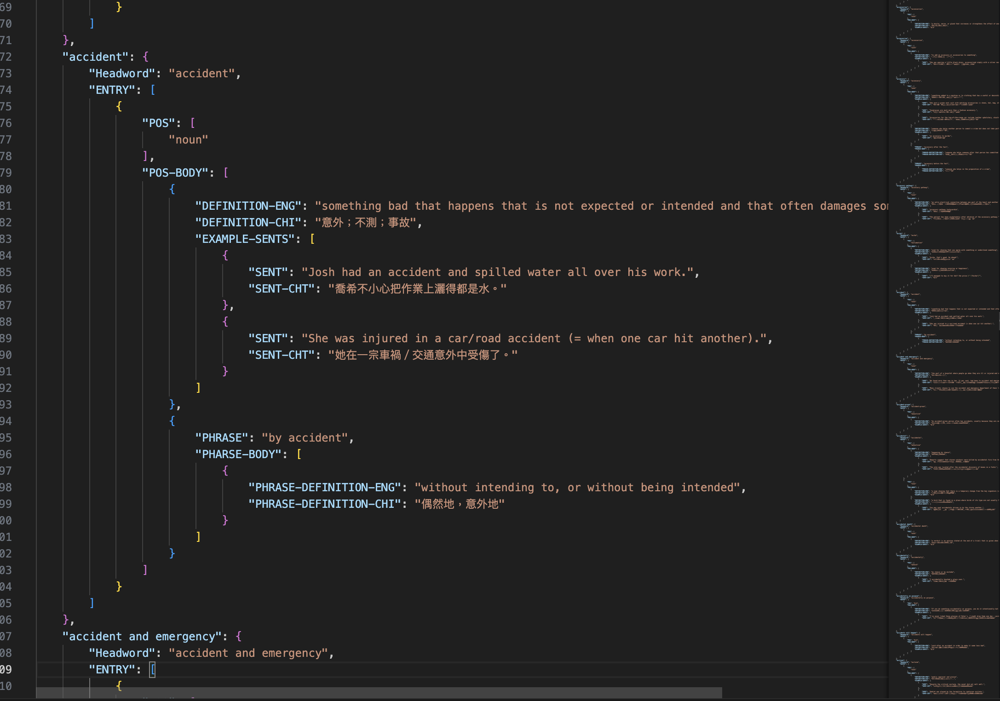
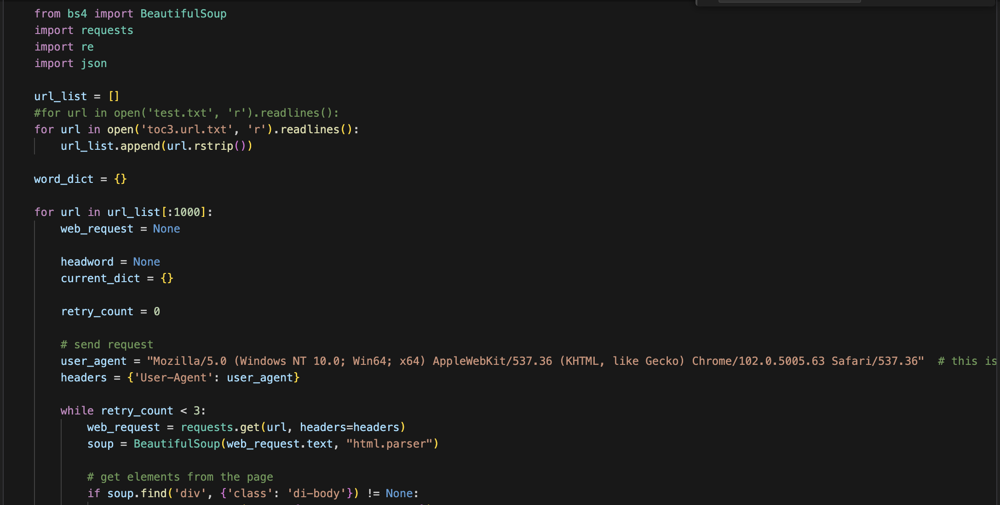
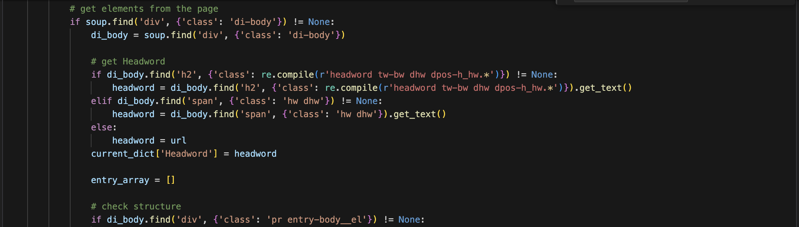
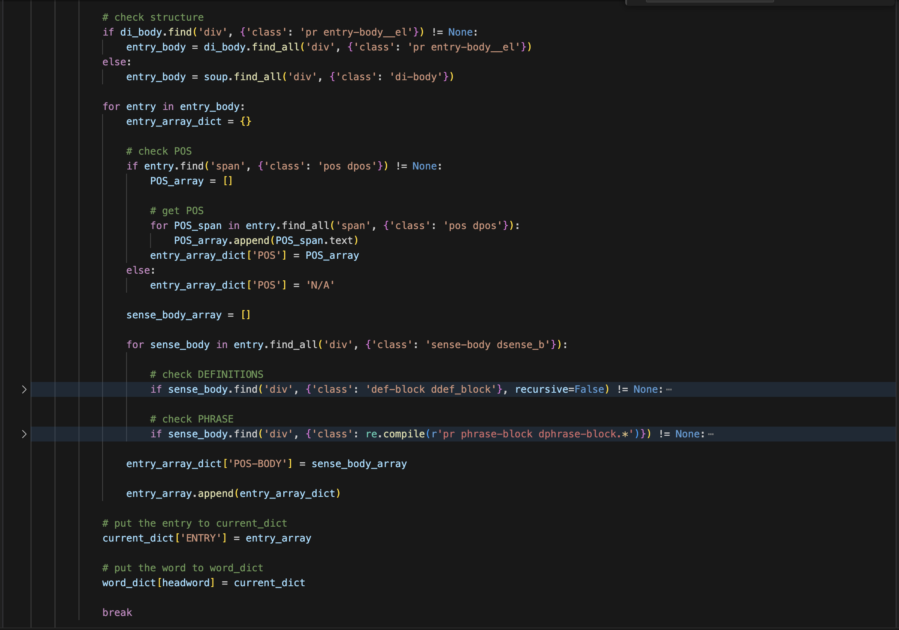
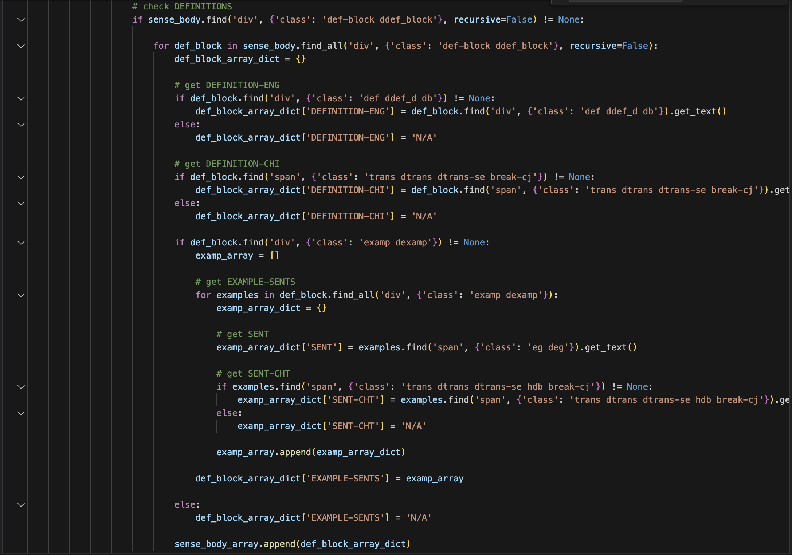
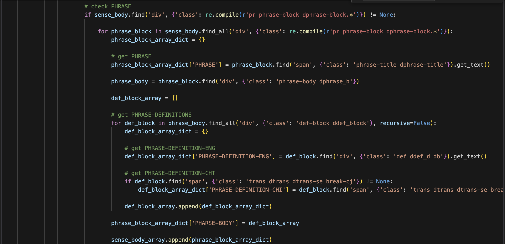
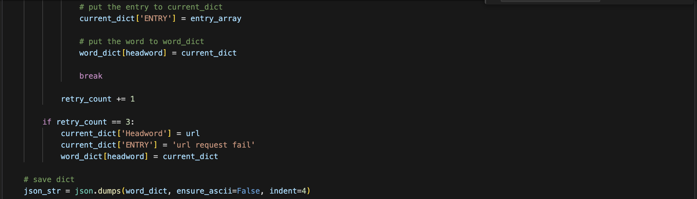

# Preprocessing for NLP using BeautifulSoup4 and UNIX Commands

In this project, we employ the BeautifulSoup4 package in Python Jupyter Notebook to scrape data from the Cambridge Dictionary website. By analyzing the HTML structure of the website, we extract relevant URLs using UNIX commands guided by formal language principles. Subsequently, we refine and organize the scraped data to construct a custom dictionary.

Note: Because scraping every URLs may take a LOT of time, we are only working with the first 1000 URLs.

## Scraped Data Structure

**word_dict:**
- Contains 1000 elements with `<headword>` as the key and an individual dictionary as the value.
  
**Individual dictionary:**
- Contains two elements:
  - "Headword" as the key with `<headword>` as the value.
  - "ENTRY" as the key with `entry_array` as the value.

**entry_array:**
- Stores one or multiple `entry_array_dict` objects.

**entry_array_dict:**
- Contains two elements:
  - "POS" as the key with `pos_array` as the value.
  - "POS-BODY" as the key with `sense_body_array` as the value.

**pos_array:**
- Stores one or multiple `<pos>` elements for the current entry.

**sense_body_array:**
- Stores one or multiple dictionaries, potentially containing `def_block_array_dict` and `phrase_block_array_dict`.

**def_block_array_dict:**
- Contains three elements:
  - "DEFINITION-ENG" as the key with `<definition>` as the value.
  - "DEFINITION-CHI" as the key with `<定義>` (definition in Chinese) as the value.
  - "EXAMPLE-SENTS" as the key with `examp_array` as the value.

**examp_array:**
- Stores one or multiple `examp_arrray_dict` objects for the current definition block.

**examp_arrray_dict:**
- Contains two elements:
  - "SENT" as the key with `<sentence>` as the value.
  - "SENT-CHT" as the key with `<例句>` (example sentence in Chinese) as the value.

**phrase_block_array_dict:**
- Contains two elements:
  - "PHRASE" as the key with `<phrase>` as the value.
  - "PHRASE-BODY" as the key with `phrase_def_block_array` as the value.

**phrase_def_block_array:**
- Stores one or multiple `phrase_def_block_array_dict` objects.

**phrase_def_block_array_dict:**
- Contains two elements:
  - "PHRASE-DEFINITION-ENG" as the key with `<phrase definition>` as the value.
  - "PHRASE-DEFINITION-CHI" as the key with `<片語定義>` (phrase definition in Chinese) as the value.

### Take "accident" For Example
   

## Scraping the Page:
- Import Modules, Initialize URL List, Read URL
- Create Dictionary and Loop
- Set up HTTP Requests and Header Information

   

- Fetching web data
- Confirm the existence of "di-body" to determine if the URL request was successful.
- Based on different word directories, set different "headword" classes to fetch actual headwords/phrases.

   

- First, confirm the structure; some web pages may not necessarily have an "entry-body". If absent, use the previous "di-body" as the index for subsequent retrieval.
- Within the "entry", fetch the part of speech ("pos"), and if absent, write "N/A".
- Within the "entry", follow the webpage structure to fetch definitions and related phrase items under "sense-body".

   

- Within the "sense-body", follow the webpage structure to fetch English and Chinese definitions under "def-block". If absent, write "N/A".
- Within "def-block", follow the webpage structure to fetch English and Chinese example sentences under "examp" and "dexamp". If absent, write "N/A".

   

- Check if "phrase-block" exists within the "sense-body".
- If present, fetch the "phrase". Within "phrase-block", follow the webpage structure to fetch English and Chinese definitions of the phrase under "def-block". If there's no Chinese definition, write "N/A".
- If absent, skip the "phrase" section.

   

- Save as JSON file:
   The JSON string is generated using json.dumps and then written to a file.

    

- Retry Mechanism:
   If a request fails (e.g., due to a network issue), the program will attempt a maximum of 3 retries.

- Handling Request Failures:
   If data cannot be retrieved even after 3 retries, the code will add the URL as the headword and append the headword with the message "URL request fail" to the word_dict.

## Resources

- [BeautifulSoup4](https://www.crummy.com/software/BeautifulSoup/bs4/doc/)